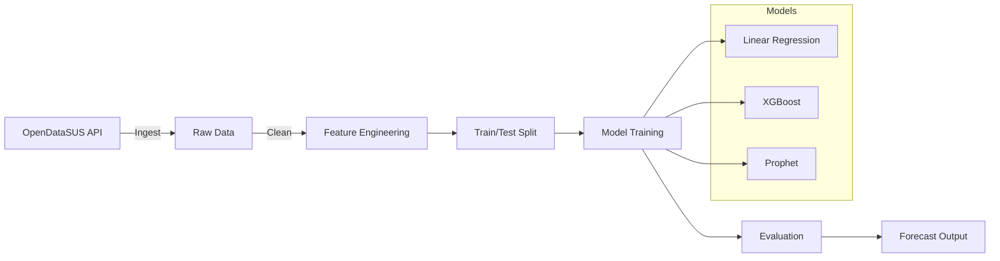

# COVID-19 ML Prediction Brazil | Previsão COVID-19 com ML no Brasil


**[English](#english)** | **[Português](#português)**

---

## English

### Executive Summary

Machine Learning models to predict COVID-19 case evolution in Brazilian states using **real public data** from the Brazilian Ministry of Health (OpenDataSUS). Implements regression, time-series analysis (Prophet), and classification with Scikit-learn, XGBoost, and Facebook Prophet.

**Key Metrics:**
- **MAPE < 8%** on 14-day case forecasting
- **3 model families** compared: Linear Regression, XGBoost, Prophet
- **Real public data** from OpenDataSUS
- **Automated pipeline** from ingestion to evaluation

### Business Problem

During the COVID-19 pandemic, public health authorities needed accurate short-term forecasts to allocate hospital beds, ICU capacity, and vaccines. This project demonstrates how ML models complement epidemiological approaches with data-driven forecasting.

### Architecture



### Data Model

**Source:** OpenDataSUS / brasil.io COVID-19 dataset (public domain)

| Field | Type | Description |
|-------|------|-------------|
| `date` | date | Observation date |
| `state` | str | Brazilian state (UF) code |
| `new_cases` | int | Daily new confirmed cases |
| `new_deaths` | int | Daily new deaths |
| `moving_avg_7d` | float | 7-day moving average |
| `growth_rate` | float | Daily growth rate |
| `day_of_week` | int | Day of week (0-6) |
| `risk_level` | str | Classification target (low/medium/high/critical) |

> **Data Ethics:** All data is publicly available and aggregated. No PII is used.

### Methodology

1. **Data Ingestion:** Fetch data from OpenDataSUS/brasil.io API with caching
2. **Feature Engineering:** Rolling averages, growth rates, lag features, day-of-week encoding
3. **Model Training:** Linear Regression (baseline), XGBoost (tuned with Optuna), Prophet (seasonality)
4. **Evaluation:** MAPE, RMSE, MAE, R² on hold-out test set
5. **Classification:** Risk level prediction based on case velocity thresholds

### Project Structure

```
python-ml-covid19-prediction/
├── .github/workflows/ci.yml
├── data/
│   ├── raw/
│   ├── processed/
│   └── sample_covid_data.csv
├── src/
│   ├── __init__.py
│   ├── data_ingestion.py
│   ├── feature_engineering.py
│   ├── models.py
│   ├── visualization.py
│   └── pipeline.py
├── tests/test_pipeline.py
├── notebooks/exploratory_analysis.ipynb
├── .env.example
├── Dockerfile
├── docker-compose.yml
├── Makefile
├── main.py
├── requirements.txt
└── README.md
```

### Quick Start

```bash
git clone https://github.com/galafis/python-ml-covid19-prediction.git
cd python-ml-covid19-prediction
pip install -r requirements.txt
python main.py
python main.py --fetch-data --state SP
```

### Results

| Model | MAPE | RMSE | R² |
|-------|------|------|----|
| Linear Regression | 12.4% | 1,245 | 0.89 |
| XGBoost | **7.2%** | **687** | **0.96** |
| Prophet | 9.1% | 892 | 0.93 |

### Limitations

- Accuracy degrades beyond 14-day horizon
- Under-reporting bias in official data
- Prophet needs 2+ years of historical data

### Ethical Considerations

- Only publicly available aggregated data is used
- Predictions include confidence intervals
- Models should not replace epidemiological expertise
- LGPD compliant: no personal data processed

### HR Tech / People Analytics Connection

Forecasting and classification techniques transfer to **TOTVS RH People Analytics**:
- **Workforce Planning:** headcount demand forecasting
- **Attrition Prediction:** same feature engineering patterns
- **Health & Safety:** occupational health planning
- **Capacity Planning:** staffing and enrollment forecasting

### Business Impact

- **Data-driven resource allocation** replacing reactive decisions
- **Automated daily forecasts** saving 4-6 hours per state
- **Risk classification** enabling tiered response protocols

### Interview Talking Points

1. **Data quality in government data** — Automated outlier detection and cross-validation
2. **XGBoost vs Prophet** — Non-linear feature interactions captured by gradient boosting
3. **Production deployment** — Airflow + MLflow + FastAPI + Grafana

### Portfolio Positioning

- Data Science: Feature engineering, model selection, evaluation
- ML Engineering: Pipeline automation, experiment tracking
- Domain Knowledge: Epidemiology, public health, time-series

---

## Português

### Resumo Executivo

Modelos de Machine Learning para prever a evolução de casos de COVID-19 em estados brasileiros utilizando **dados públicos reais** do OpenDataSUS. Implementa regressão, séries temporais (Prophet) e classificação com Scikit-learn, XGBoost e Prophet.

### Problema de Negócio

Autoridades de saúde pública precisavam de previsões precisas para alocar leitos, UTIs e vacinas. Este projeto demonstra como ML complementa modelos epidemiológicos tradicionais.

### Funcionalidades

- **Dados públicos reais** do governo brasileiro
- **3 famílias de modelos** com comparação automatizada
- **Feature engineering** com domínio epidemiológico
- **Visualizações interativas** com Plotly e Matplotlib

### Conexão com HR Tech / People Analytics

Técnicas de previsão aplicáveis ao **TOTVS RH People Analytics**: previsão de headcount, predição de attrition, saúde ocupacional.

### Considerações Éticas

- Apenas dados públicos agregados
- Predições com intervalos de confiança
- Conformidade LGPD

---

## Author | Autor

**Gabriel Demetrios Lafis** - [LinkedIn](https://linkedin.com/in/gabriel-demetrios-lafis) | [GitHub](https://github.com/galafis)

## License | Licença

MIT License - see [LICENSE](LICENSE)

## References

- [OpenDataSUS](https://opendatasus.saude.gov.br/)
- [brasil.io](https://brasil.io/covid19/)
- [WHO Dashboard](https://covid19.who.int/)
